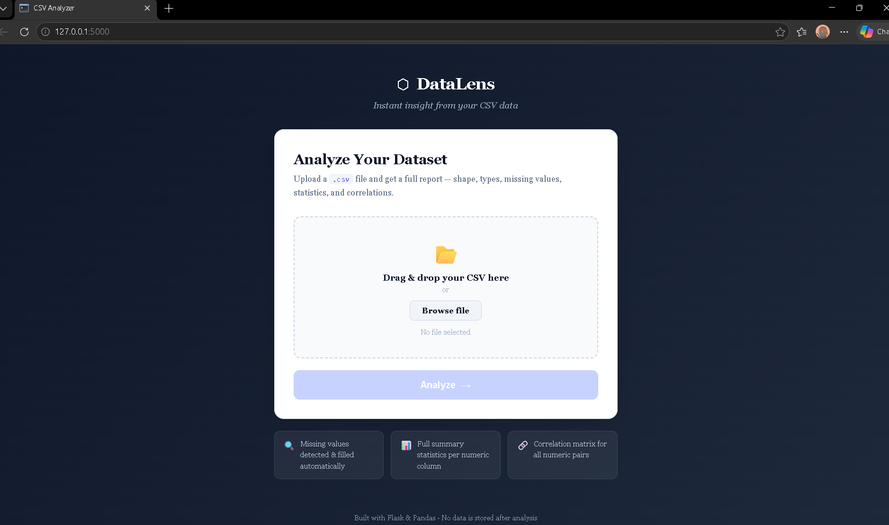
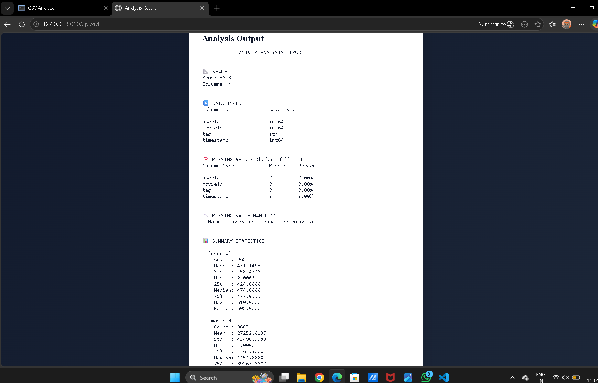

# AI Data Science Agent


## Project Overview

AI Data Science Agent is a lightweight web application that automates structured dataset analysis using Python, Pandas, and NumPy. Users can upload CSV datasets and instantly receive cleaned data summaries, statistical insights, missing value analysis, and feature-level information through a simple web interface.

The project is designed to simplify exploratory data analysis (EDA) workflows and support data-driven decision-making.

---

## Features

* Upload and analyze CSV datasets
* Automated data cleaning and preprocessing
* Missing value detection
* Statistical summary generation
* Data type identification
* Correlation analysis
* Simple and responsive web interface
* Automated report generation

---

## Technologies Used

* Python
* Flask
* Pandas
* NumPy
* HTML
* CSS
* JavaScript

---

## Installation Steps

### 1. Clone Repository

```bash
git clone https://github.com/sagartripathi027/Data-Science-Agent-1.git
```

### 2. Install Dependencies

```bash
pip install -r requirements.txt
```

---

## How to Run

Start the Flask server:

```bash
python app.py
```

Open browser:

```text
http://127.0.0.1:5000
```

---

## Example Workflow

1. Open the application in browser
2. Upload a CSV dataset
3. System processes the dataset automatically
4. View:

   * dataset shape
   * missing values
   * statistical summaries
   * correlations
5. Generate insights for analysis

---

## Folder Structure

```text
AI-Data-Science-Agent/
│
├── app.py
├── analysis.py
├── requirements.txt
├── README.md
│
├── data/
├── uploads/
├── reports/
│
├── templates/
│   └── index.html
│
└── static/
    ├── style.css
    └── script.js
```

---
## Screenshots

### Home Page



### Analysis Result



## 🏆 Resume-Ready Description

**AI Data Science Agent** | Python, Flask, Pandas, NumPy, JavaScript

- Architected and deployed a full-stack AI-powered data analysis web application capable of processing structured CSV datasets with zero manual configuration.
- Engineered automated EDA pipelines covering data cleaning, missing value detection, statistical summaries, correlation matrices, and feature-level analysis.
- Built a responsive Flask-based REST API backend integrated with a dynamic frontend for real-time dataset uploads and instant insight generation.
- Reduced exploratory data analysis time by automating repetitive preprocessing and reporting workflows end-to-end.

## 🚀 What's Coming Next

- [ ] Support for Excel (.xlsx) file uploads
- [ ] AI-generated insights using LLM
- [ ] Data visualization charts (bar, pie, heatmap)
- [ ] Export analysis report as PDF
- [ ] User authentication and history
- [ ] Deploy on cloud (AWS / Render)
